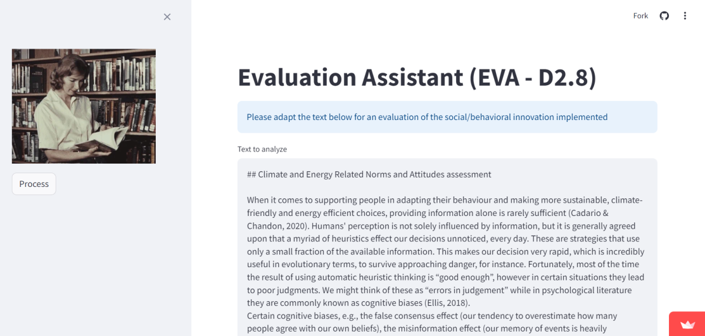

# Social Innovation Analyser

## The Evaluation Assistant (EVA)

The Evaluation Assistant (EVA) is a tool that helps social and behavioural innovation evaluators complete their assessment using the framework detailed in section 2.3. It is currently a functioning prototype that will be further developed and refined throughout the project. This section will present the technical details, the procedure, and the evaluation components and output.

EVA is a bot that uses Python as a language and OpenAI as the Large Lange Model (LLM) Application Programming Interface (API) provider, served using the Python Streamlit web app framework. These are relatively proven tools, allowing the team to focus on the real innovation, the AI component.

The LLM of choice is gpt3.5-turbo, balancing cost and accuracy, but it can easily be made to use any OpenAI LLM model, such as gpt4o. Most of the development work to upscale it from a proof of concept to a ready-to-use product will be on gathering requirements, primarily in defining the right prompts to achieve its objectives. The proof of concept developed for this project has reached the point of piecing the different requirements together, and most of the innovation will come from the right instructions to be passed to EVA. Furthermore, the user journey, user interface, and experience need improvement (see below for a screenshot of the user interface).

*User interface of EVA*

The role description which EVA is prompted with is *“You are an international expert in behavioural science and social innovation. You are part of a team of experts working on the assessment of a social innovation, which is detailed below. Your role is to provide a concise but very accurate assessment of the text”*. This prompt will guide the bot to analyse the provided text through the lenses of a professional working with social and behavioural science, as opposed to the generic persona used by OpenAI.

### Roles and responsibilities in the evaluation process

Before outlining the evaluation process, defining the roles and responsibilities is necessary. The process includes three actors: the Evaluator, EVA, and the Submitter.

* *The Evaluator* initiates the evaluation process by uploading a description of the social/behavioural innovation to EVA. This description should be available from *D2.3: Social and Behavioural Innovations Design*. The Evaluator will also receive the final evaluation report. In practice, the Evaluator will be the T2.6 leader.
* *EVA* will process the description of the social/behavioural innovation based on the EVA Framework and pre-fill the evaluation questions to be prompted to the submitter. EVA will also prepare the final evaluation report.
* *The Submitter* will assess and adapt the answers to the relevant evaluation questions after which they will refine and approve the analysis. The Submitter will download the evaluation report prepared by EVA and send it to the Evaluator. In practice, the Submitter will be the organisation responsible for implementing the specific social/behavioural innovation.

It is very important to emphasize that the quality of the evaluation of the social and behavioural innovations will not be compromised by the performance of EVA. That is, the evaluation will take place following the same framework, regardless of the usability and functionality of EVA. The process will ensure a human review of the analysis and that necessary data is gathered regardless.

### Evaluation process

The process is organised in 4 steps (see below).

* *Step 1* involves preparing the evaluation process, meaning that the Evaluator uploads the description of the social or behavioural innovation to EVA and sends an invitation with instructions to the Submitter.
* *Step 2* is where the Submitter fills in the evaluation form. The evaluation form (that is, the user interface structured in Streamlit) will be pre-filled with the analysis conducted by EVA, based on the information given under Step 1. The Submitter is then invited to answer the relevant evaluation questions by refining and confirming the text proposed by EVA directly in the app (see below for a screenshot where the editable text field is marked in red).
* *Step 3* is the processing of the final evaluation report by EVA
* *Step 4* is where the report is sent to the Evaluator and Submitter, respectively.

*Screenshot of EVA's user interface highlighting the editable text field*

The four steps are visualised in the figure below, but as EVA is still under development, using the tool in practice might suggest some changes to the process.

*Evaluation process*

### Evaluation prompts

To allow for a systematic and comprehensive evaluation, EVA has been programmed to answer all the indicator dimensions (social, environmental, economic, political, educational, innovative process), identify the level(s) of analysis, spatial scope(s), and time horizon, and indicate the output, outcome, and impact on all six dimensions.

In Step 2 (see previous section), the first question to answer for the submitter is *“Please tell me more about the activities performed and the results achieved through the social/behavioural innovation activity”*. The editable text field will be pre-filled with the initial description of the social/behavioural innovation uploaded by the Evaluator under Step 1. This serves two purposes: First, it reminds the submitter of the initial objectives of the specific activity. Second, it assists EVA in asking the mandatory follow-up questions. The information below is EVA’s assessment of the *inputs* to the Geodesign workshop at the AU Living Lab (11 April 2024, Campus Viborg).

*Example of EVA's assessment of the inputs to a Geodesign workshop*

The 15 mandatory follow-up questions are structured to cover all the indicators’ dimensions, output, outcome, and impact of the social/behavioural innovation (see Appendix 1: Evaluation prompts, for the full list of questions). While it’s mandatory for EVA to assess the uploaded description of the innovation, it is *not* mandatory for the Submitter to answer all. Hence, if the Submitter finds that the implemented innovation had no objectives related to, e.g., the political dimension, they can choose to disregard this question by leaving it empty or typing in ‘irrelevant’. This step ensures a human review of the data and invites the Submitter to consider all indicators’ dimensions of the implemented activity while not forcing them to spend time on irrelevant information. Once the submitter is satisfied with the information and analysis, they will save it, and EVA can prepare the final evaluation report.

### Evaluation report

The evaluation report is a downloadable Excel file. This format will allow evaluators to edit the text and add quantitative data or additional comments related to the specific. The report will include the following:

* A summary of 3 key *outputs* in bullet format. The bullets will be one sentence explaining the purpose of the output.
* A summary of 3 key *outcomes* in bullet format. The answer will consider the most relevant dimensions and levels. Each bullet will be a maximum of 400 words.
* A summary of the expected *impact* of the social or behavioural innovation. The answer will consider the most relevant dimensions and levels and will be presented as a coherent, concise text of maximum 500 words.
* A summary of the key *lessons learned* during the implementation of the social or behavioural innovation. The answer will consider what went well, any barriers, and any of the original objectives that were not met.
* A list with 3 *recommendations for future implementation*. In your answer, you should consider in what cases this social or behavioural innovation is relevant. Each recommendation should be a maximum of 200 words.
* An *evaluation summary* for each indicator dimension of a maximum of 150 words.
* A *colour-coded overview* (in practice, a dot) for each dimension, categorized by output, outcome, and impact. The colours represent the following:

* ●=Highly satisfactory
* ●=Satisfactory but improvements needed
* ●=Not satisfactory
* ●=Irrelevant

For transparency, the evaluation report will also include two annexes. One with the answers given to the 15 mandatory questions and the second, the verbose file with EVA’s mapping of the evaluation text against the evaluation framework. A screenshot of such a file can be seen below which was generated by an evaluation of the CERNA assessment tool conducted by EVA. As can be seen, EVA generates a justification for each component relative to the evaluation framework. The text in the example has *not* undergone human review, but it illustrates how EVA generates its assessment of the different dimensions and aspects of the evaluation framework. With further training and refined definitions, this assessment will continuously be improved.

*EVA’s review of CERNA assessment tool relative to the evaluation framework*

# Acknowledgements

We gratefully acknowledge the funding support of the European Union
Horizon 2020 research project PROBONO under grant agreement no.
101037075. Thank you to the PROBONO team.

# License

## CC by NC ND 

* © 2025 Smart Innovation Normay, Mott MacDonald  
* This work is licensed under the Creative Commons Attribution-NonCommercial-NoDerivatives 4.0 International License (CC BY-NC-ND 4.0).  
* https://creativecommons.org/licenses/by-nc-nd/4.0/

## In short

You are free to:
* Share — copy and redistribute the material in any medium or format
* The licensor cannot revoke these freedoms as long as you follow the license terms.

Under the following terms:
* Attribution — You must give appropriate credit , provide a link to the license, and indicate if changes were made . You may do so in any reasonable manner, but not in any way that suggests the licensor endorses you or your use.
* NonCommercial — You may not use the material for commercial purposes .
* NoDerivatives — If you remix, transform, or build upon the material, you may not distribute the modified material.
* No additional restrictions — You may not apply legal terms or technological measures that legally restrict others from doing anything the license permits.

Notices:
* You do not have to comply with the license for elements of the material in the public domain or where your use is permitted by an applicable exception or limitation .
* No warranties are given. The license may not give you all of the permissions necessary for your intended use. For example, other rights such as publicity, privacy, or moral rights may limit how you use the material.